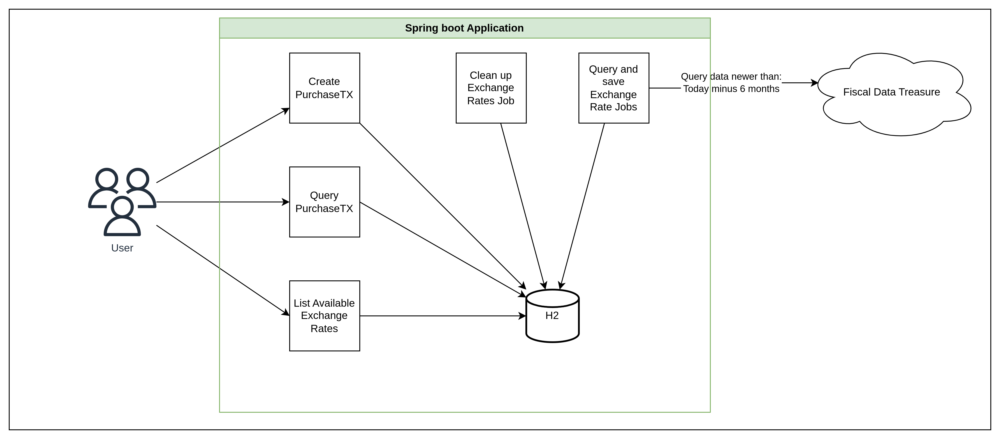
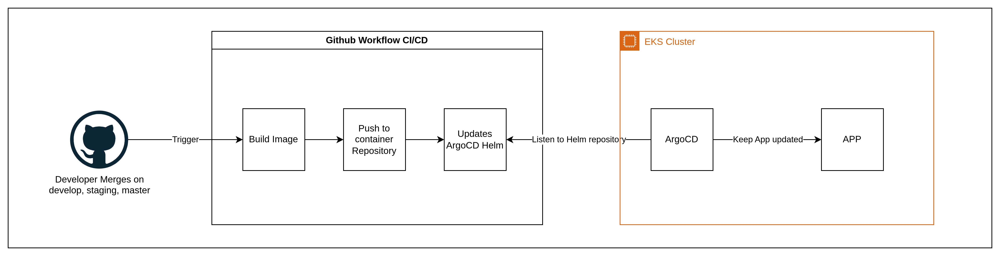

# WEX PurchaseTX

This projects contains the source code of the project responsible for storing and querying purchase transactions.

You will always store transactions in USD.

You can retrieve the transaction in any currency supported by Treasury Reporting Rates of Exchange.

## Project Architecture:

The application runs with:

* Spring Boot 3.2.0
* Java 17
* H2 Database
* Reactive Webflux (The entire project is reactive)
* R2DBC

### Locally:
Locally, the project has:

1. Purchase Transaction Controller, with:
   1. Get By Id
   2. Find All
   3. Create
2. Exchange Rate Controller, with:
   1. Find All
3. Cron Job to find Exchange Rate
   1. We query data that is greater than: today - 6 months
   2. Since the data is updated every quarter, the job is running once per month just to make sure if there's a new update.
4. Cron Job to clean up the Exchange Rates older than 6 months
   1. Runs every day.
5. H2 DB
   1. Attending to the requirement that the application must be able to run by itself, the choosed DB is H2.
   

### Overview:




### CI/CD Pipeline

We are using ArgoCD to keep our application updated.



Take a look on the [Helm repository](https://github.com/VitorNilson/puchase-tx-wex-helm)

## Infrastructure Architecture:

You can access [here](https://drive.google.com/file/d/1OZUOXb9kvrrqX-lSJ2SxKcDeA2zreZAh/view?usp=sharing) the AWS architecture.

Basically, the project has
1. AWS EKS Cluster
   2. Two Node Groups:
      1. On Demand Node Group for the Application
      2. Spot Node Group for CronJobs
   3. One Application Load LoadBalancer created by a Ingress
4. VPC
   1. Two private and four public subnets
      1. Private for Application and RDS
      2. Public for CronJobs since they must reach internet.
   2. Internet Gateway (for the public subnet)
5. RDS Postgres


## Running Locally

You can simply run:

```bash
./gradlew bootRun
```

And then access the [Swagger Docs](http://localhost:8080/swagger-ui.html) to see and run the requests.


## Test coverage

You can run:

```bash
./gradlew clean test
```

And then access the [JaCoCo test report](./build/reports/jacoco/test/html/index.html) to see the coverage.

You can also access [Gradle test report](./build/reports/tests/test/index.html) to see some information such as the test running time and etc...

## Production Deployment:
To deploy this project, there is a bash script that applies the cloudformation stack.

Keep in mind that AWS will start billing you at the moment you deploy this stack.


### Before running

Ensure that you have AWS CLI configured. You need policy to create cloudformation stacks, ensure that on IAM screen.

If you are running on windows, I would recommend you to run this script on git bash, it would not work properly on Windows CMD or Powershell.

### Running

Run:

```bash
./create_aws_stack_application.sh
```


## Destroying the application

Finally, if you do not need to keep the application running, you need to prune the resources to avoid long term costs.

There's a script for that.

Run:

```bash
./destroy_aws_stack_application.sh
```


## Final considerations

Why did I choose to build an entire reactive application?
Because the Event Loop.
A traditional application instantiates a new Thread per request. This is not a problem until we had millions and millions of requests in our application.
In this scenario, we would need more and more infrastructure resources to handle the requests with zero downtime.

As Reactive Applications doesn't (or essentialy don't, because they do) instantiate new Threads per requests, but use something called Event Loop,
our application is born already prepared to handle millions of requests using less resources.

We have other advantages such as backpressure, but I'm not using none of those here. I'm only taking advantage of the Event Loop nature.

Other infos:

* This repository does not contain the real world production code. In a real world production code it would be:
   - One repository for the application.
   - One repository for the CronJobs.

It would be different because:
   - A real world application cannot scale containing CronJobs within it. Jobs must be atomic, run isolated.
     -  If we scale our application to 100 PODs, we could have 100 CronJobs running in parallel, and this is not what a CronJob essentialy is meant to.
     - Since CronJobs are asynchronous, our cloudformation stack creates Spot Instance node groups. These instances are cheaper, but we cannot guarantee when and how long we could have one available.

* For cost optimization, the cloudstack deploys one `tg4.medium` EC2 instance Type. This instance can support up to 3 "real world" pods.
In a production environment, that needs to handle millions of requests, 3 pods could be a bottleneck.
We would deploy our application in a little bit more robust instance type, so we will monitor and adjust the instance type we whe had real world data usage.

* Also, for cost optimization, I didn't deploy the RDS instances or else installed the postgres and changed our application properties.
To do that, I would need (again) a more robust instance type.

* I decided to omit some configurations such as:
  * Deploy ArgoCD and configure it with the Helm Chart repository.
  * Configure the application to use RDS as the database based on environments.
  * Configure the Cluster Autoscaler.

I'm aware that, yes, I can configure all that with a brash script, but I decided only to show you some knowledge about AWS and application scalability. 
   
I also understand that we can use an existing cluster, but I'm considering that not and this is why there's a cloudformation stack for this purpose.